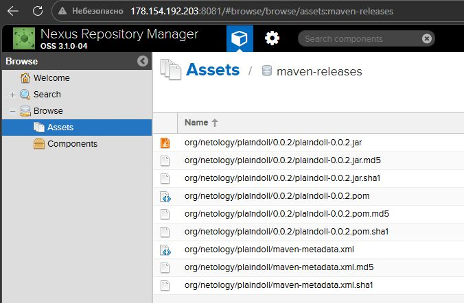
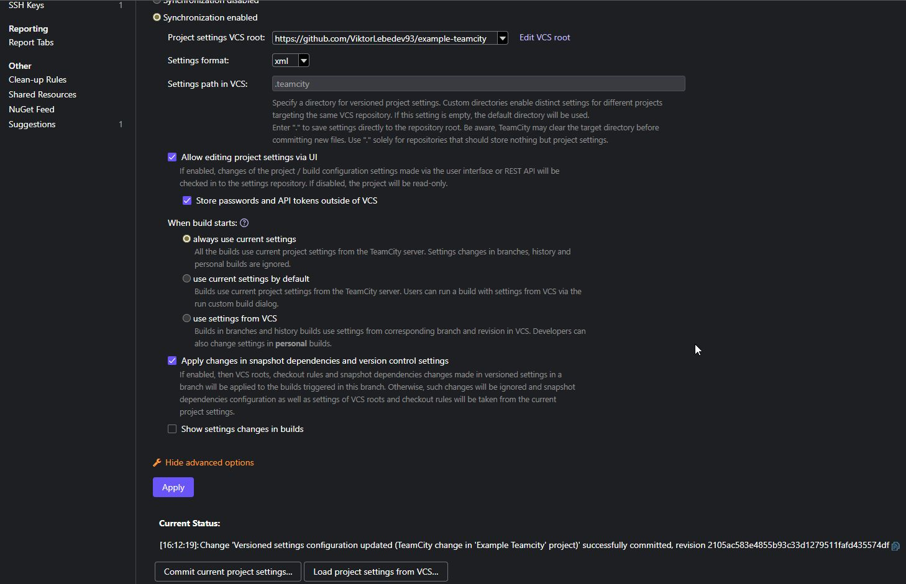
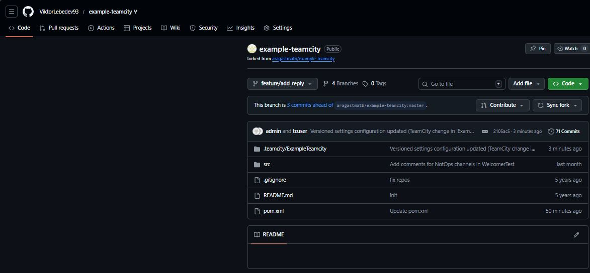
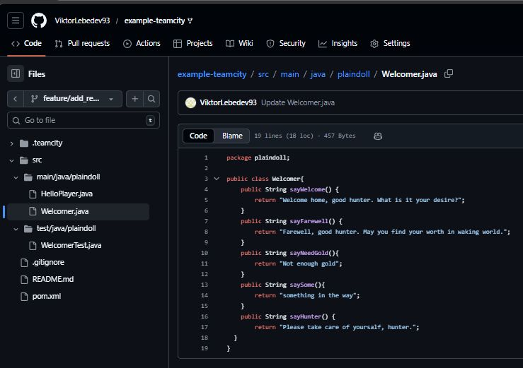
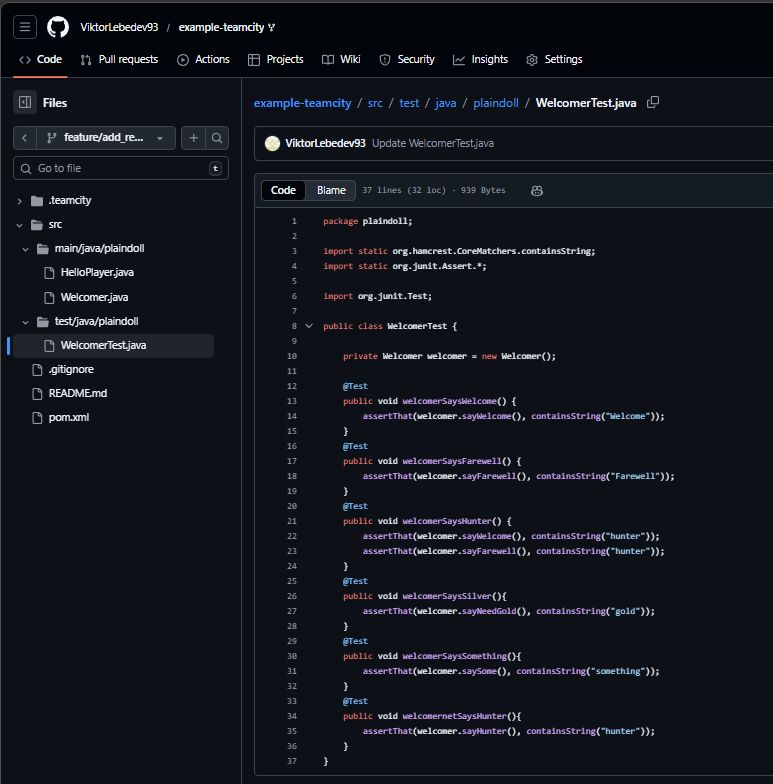
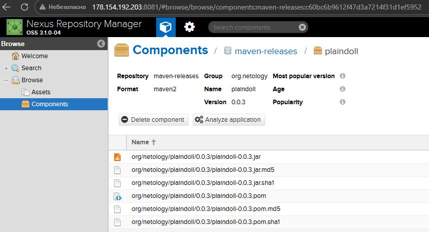

# Домашнее задание к занятию 11 «Teamcity» - Лебедев В.В. FOPS-33

## Подготовка к выполнению

1. В Yandex Cloud создайте новый инстанс (4CPU4RAM) на основе образа `jetbrains/teamcity-server`.
2. Дождитесь запуска teamcity, выполните первоначальную настройку.
3. Создайте ещё один инстанс (2CPU4RAM) на основе образа `jetbrains/teamcity-agent`. Пропишите к нему переменную окружения `SERVER_URL: "http://<teamcity_url>:8111"`.
4. Авторизуйте агент.
5. Сделайте fork [репозитория](https://github.com/aragastmatb/example-teamcity).
6. Создайте VM (2CPU4RAM) и запустите [playbook](./infrastructure).

Создал инстансы в Yandex Cloud


Авторизовал агент


Создал VM с Nexus


Создал форк репозитория
https://github.com/ViktorLebedev93/example-teamcity


## Основная часть

1. Создал новый проект в teamcity на основе fork.


2. Сделал autodetect конфигурации.


3. Сохранил необходимые шаги, запустил первую сборку master.


4. Поменял условия сборки: если сборка по ветке `master`, то должен происходит `mvn clean deploy`, иначе `mvn clean test`.


5. Для deploy загрузил [settings.xml](./teamcity/settings.xml) в набор конфигураций maven у teamcity, предварительно записав туда креды для подключения к nexus.


6. В pom.xml поменял ссылку на репозиторий и nexus.


7. Запустил сборку по master, убедился, что всё прошло успешно и артефакт появился в nexus.



8. Мигрировал `build configuration` в репозиторий.



9. Создана отдельная ветка `feature/add_reply` в репозитории.



10. Написал новый метод для класса Welcomer: метод должен возвращать произвольную реплику, содержащую слово `hunter`.



11. Дополнил тест для нового метода на поиск слова `hunter` в новой реплике.



12. Сделал push всех изменений в новую ветку репозитория.
13. Убедился, что сборка самостоятельно запустилась, тесты прошли успешно.
14. Внес изменения из произвольной ветки `feature/add_reply` в `master` через `Merge`.
15. Убедился, что нет собранного артефакта в сборке по ветке `master`.
16. Настроил конфигурацию так, чтобы она собирала `.jar` в артефакты сборки.
17. Провел повторную сборку мастера, убедился, что сбора прошла успешно и артефакты собраны.
18. Проверил, что конфигурация в репозитории содержит все настройки конфигурации из teamcity.



[Netology_ExampleTeamcity_Build.xml](https://github.com/ViktorLebedev93/example-teamcity/blob/master/.teamcity/ExampleTeamcity/buildTypes/ExampleTeamcity_Build.xml)

```xml
<?xml version="1.0" encoding="UTF-8"?>
<build-type xmlns:xsi="http://www.w3.org/2001/XMLSchema-instance" uuid="21ff9128-c507-4928-80c8-5fa3ba91afaf" xsi:noNamespaceSchemaLocation="https://www.jetbrains.com/teamcity/schemas/2025.3/project-config.xsd">
  <name>Build</name>
  <description />
  <settings>
    <options>
      <option name="artifactRules" value="target/*.jar =&gt; artifacts" />
    </options>
    <parameters>
      <param name="branch_name" value="%teamcity.build.branch%" />
    </parameters>
    <build-runners>
      <runner id="Run_tests" name="Run tests" type="Maven2">
        <conditions>
          <does-not-equal name="branch_name" value="master" />
        </conditions>
        <parameters>
          <param name="goals" value="clean test" />
          <param name="localRepoScope" value="agent" />
          <param name="maven.path" value="%teamcity.tool.maven.DEFAULT%" />
          <param name="pomLocation" value="pom.xml" />
          <param name="teamcity.coverage.emma.include.source" value="true" />
          <param name="teamcity.coverage.emma.instr.parameters" value="-ix -*Test*" />
          <param name="teamcity.coverage.idea.includePatterns" value="*" />
          <param name="teamcity.coverage.jacoco.patterns" value="+:*" />
          <param name="teamcity.step.mode" value="default" />
          <param name="teamcity.tool.jacoco" value="%teamcity.tool.jacoco.DEFAULT%" />
          <param name="userSettingsSelection" value="userSettingsSelection:default" />
        </parameters>
      </runner>
      <runner id="Deploy_to_Nexus" name="Deploy to Nexus" type="Maven2">
        <conditions>
          <equals name="branch_name" value="master" />
        </conditions>
        <parameters>
          <param name="goals" value="clean deploy" />
          <param name="localRepoScope" value="agent" />
          <param name="maven.path" value="%teamcity.tool.maven.DEFAULT%" />
          <param name="pomLocation" value="pom.xml" />
          <param name="teamcity.coverage.emma.include.source" value="true" />
          <param name="teamcity.coverage.emma.instr.parameters" value="-ix -*Test*" />
          <param name="teamcity.coverage.idea.includePatterns" value="*" />
          <param name="teamcity.coverage.jacoco.patterns" value="+:*" />
          <param name="teamcity.step.mode" value="default" />
          <param name="teamcity.tool.jacoco" value="%teamcity.tool.jacoco.DEFAULT%" />
          <param name="userSettingsSelection" value="settings.xml" />
        </parameters>
      </runner>
    </build-runners>
    <vcs-settings>
      <vcs-entry-ref root-id="ExampleTeamcity_HttpsGithubComViktorLebedev93exampleTeamcityRefsHeadsMaster" />
    </vcs-settings>
    <build-triggers>
      <build-trigger id="TRIGGER_2" type="vcsTrigger">
        <parameters>
          <param name="branchFilter" value="+:*" />
          <param name="enableQueueOptimization" value="true" />
          <param name="quietPeriodMode" value="DO_NOT_USE" />
        </parameters>
      </build-trigger>
    </build-triggers>
    <build-extensions>
      <extension id="perfmon" type="perfmon">
        <parameters>
          <param name="teamcity.perfmon.feature.enabled" value="true" />
        </parameters>
      </extension>
    </build-extensions>
  </settings>
</build-type>

```

19. Ссылка на репозиторий.

https://github.com/ViktorLebedev93/example-teamcity

---

### Как оформить решение задания

Выполненное домашнее задание пришлите в виде ссылки на .md-файл в вашем репозитории.

---